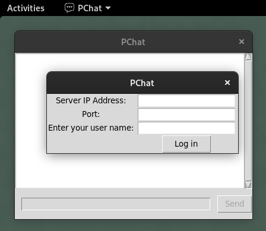
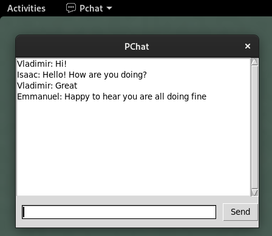

 
 
# PChat
Chat room application implemented in Python 3. Client side supports GUI made with Tkinter.

## Screenshots
 
 
 
## Usage
### Server
``` sh
 python3 ./server.py -p port
```
### Client
Click on the "client" executable. 
 
# PChat
Chat room application implemented in Python 3. Client side supports GUI made with Tkinter.

## Screenshots
 
 
 
## Usage
### Server
``` sh
 python3 ./server.py -p port
```
### Client
Click on the "client" executable.
